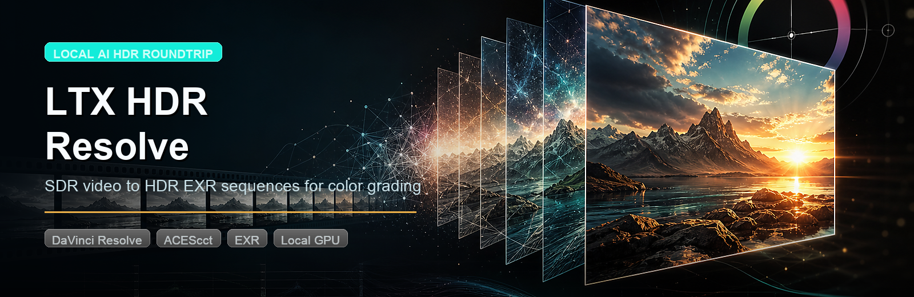

# LTX HDR Resolve v1



Local-first DaVinci Resolve integration for LTX HDR IC-LoRA.

## Windows Install

For Windows users, the install path is:

```text
1. Download or clone this repository.
2. Double-click Install-Windows.cmd.
3. Restart DaVinci Resolve.
```

The installer file is at the repository root:

```text
Install-Windows.cmd
```

It installs the Resolve menu script, writes `%USERPROFILE%\.ltx-hdr-resolve\config.json`, and uses folders next to `Install-Windows.cmd`.

**Disk space warning:** this installer downloads very large model files. The base checkpoint is about 43 GB by itself, and the full local setup plus caches and generated EXR output can easily exceed 100 GB. Keep at least **120 GB free** on the drive containing `ltx-hdr-resolve` before running the installer.

By default, it keeps everything inside the cloned `ltx-hdr-resolve` folder:

```text
ltx-hdr-resolve\
  LTX-Video\   # local LTX-2 checkout
  models\      # downloaded .safetensors model files
  output\      # generated jobs, logs, previews, EXR frames
```

After restarting Resolve, run:

```text
Workspace -> Scripts -> Utility -> LTX HDR Convert Current Clip
```

The installer downloads LTX, creates the local Python environment, and downloads the model files. Because the LTX model files are gated on Hugging Face, it will open the required Hugging Face pages and ask for a read token when model downloads are needed.

Required Hugging Face pages:

- [LTX-2.3 base model](https://huggingface.co/Lightricks/LTX-2.3)
- [LTX HDR IC-LoRA model access form](https://huggingface.co/Lightricks/LTX-2.3-22b-IC-LoRA-HDR)
- [LTX HDR IC-LoRA Files tab](https://huggingface.co/Lightricks/LTX-2.3-22b-IC-LoRA-HDR/tree/main)
- [Create a Hugging Face read token](https://huggingface.co/settings/tokens/new?tokenType=read)

The HDR model is gated. You must complete the Hugging Face access form/request for the HDR model before downloads work. The installer checks this before downloading the large model files.

Advanced users can run `.\scripts\install_windows.ps1 -CustomPaths` to choose different folders.

## What This Does

This v1 is intentionally organized as a Resolve menu script plus an external local worker:

- Resolve script: runs inside DaVinci Resolve, finds the current timeline clip, calls the worker, imports the generated EXR sequence, and adds it as a take.
- Local worker: runs in the user's normal Python environment, validates the LTX checkout and model paths, then executes the local HDR conversion pipeline.
- Config: lives in `~/.ltx-hdr-resolve/config.json` so model weights, output folders, and the LTX repo stay local to the machine.

## Why this shape

LTX HDR is not a lightweight color transform. It converts SDR video into HDR EXR frames using a large local model pipeline. Keeping that work outside Resolve avoids loading PyTorch into Resolve's scripting interpreter and makes GPU/runtime failures easier to diagnose.

## Requirements

- DaVinci Resolve or Resolve Studio with scripting enabled.
- Python 3.11 runtime for LTX.
- `uv` for setting up the LTX repo environment.
- NVIDIA GPU with enough VRAM for the LTX HDR workflow.
- At least 120 GB free disk space on the install/output drive.
- Local copies of the LTX model files:
  - `ltx-2.3-22b-distilled-1.1.safetensors`
  - `ltx-2.3-spatial-upscaler-x2-1.1.safetensors`
  - `ltx-2.3-22b-ic-lora-hdr-0.9.safetensors`
  - `ltx-2.3-22b-ic-lora-hdr-scene-emb.safetensors`

## macOS / Manual Install

1. Copy the config template:

   ```bash
   mkdir -p ~/.ltx-hdr-resolve
   cp config/config.example.json ~/.ltx-hdr-resolve/config.json
   ```

2. Edit `~/.ltx-hdr-resolve/config.json` and point it at your LTX repo, venv Python, model files, and output folder.

3. Run the diagnostic:

   ```bash
   python3 src/ltx_hdr_worker.py diagnose --config ~/.ltx-hdr-resolve/config.json
   ```

   See [docs/local-ltx-setup.md](docs/local-ltx-setup.md) for the full local workstation setup.

4. Install the Resolve script:

   ```bash
   ./scripts/install_resolve_script.sh
   ```

5. Restart Resolve. The menu item appears under:

   ```text
   Workspace -> Scripts -> Utility -> LTX HDR Convert Current Clip
   ```

## Use

1. Open the timeline in Resolve.
2. Move the playhead onto the clip you want to convert.
3. Run `Workspace -> Scripts -> Utility -> LTX HDR Convert Current Clip`.
4. The worker processes the source media locally.
5. Resolve imports the generated EXR sequence into an `LTX HDR` bin and adds it as a take on the current timeline item when supported by the host API.

## Current v1 behavior

- Processes the current timeline clip's source file, not only the timeline-trimmed range.
- Imports the generated EXR sequence as one media-pool item.
- Adds the EXR media as a take on the current clip when Resolve accepts it.
- Prints worker progress in the Resolve console and writes job manifests/logs under the configured output directory.
- Windows installer downloads the required model files after Hugging Face access is accepted; manual installs must provide local model paths.
- Does not change project color-management settings automatically yet.

## Recommended Resolve color settings

For imported HDR EXR files, use the LTX-recommended Resolve settings:

- Color science: `ACEScct`
- ACES version: `ACES 2.0`
- ACES Input Transform: `sRGB (Linear) - CSC`
- ACES Output Transform: `Rec.2100 ST.2084 (1000 nit)`

Also enable 10-bit precision in viewers if available.

## Next steps after v1

- Timeline-range export before LTX processing.
- Workflow Integration panel for queue/progress/config.
- Project color-management checker with user confirmation.
- Optional side-by-side tonemapped preview import.
- Platform-specific installer zips.
